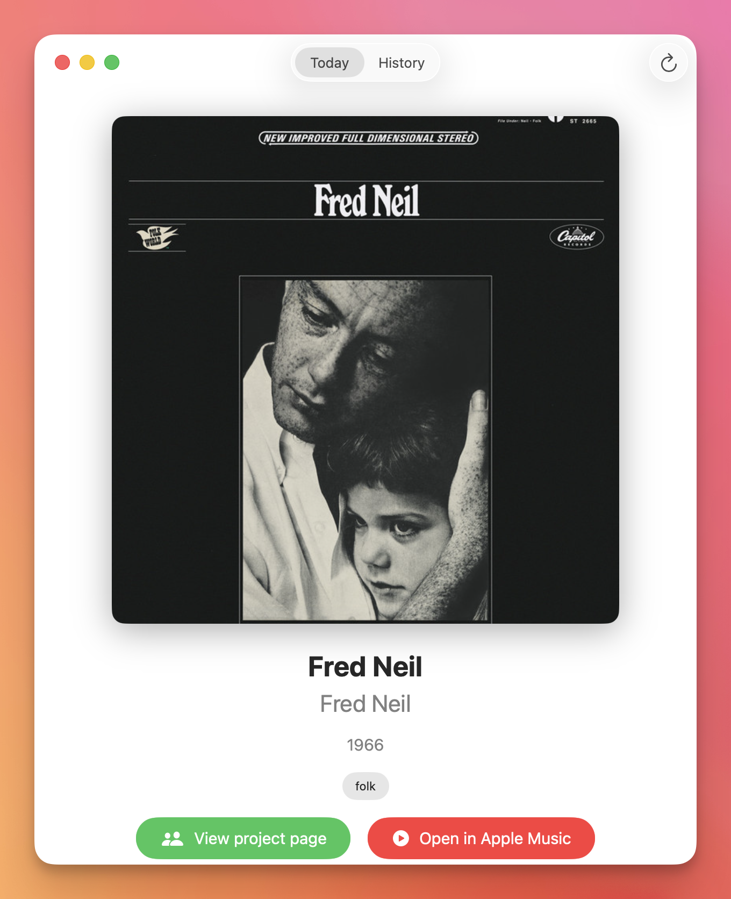
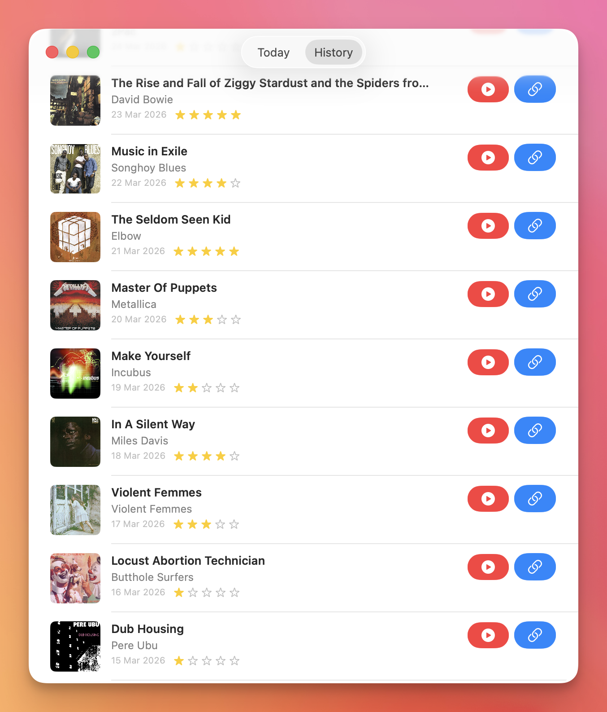

An experiment with Claude Code to create a native Mac app in Swift for the website [https://1001albumsgenerator.com](https://1001albumsgenerator.com).

You can build the source code here in Xcode to try the app. On launch, simply enter your 1001 albums project page name, and it will sync your history and current album.

